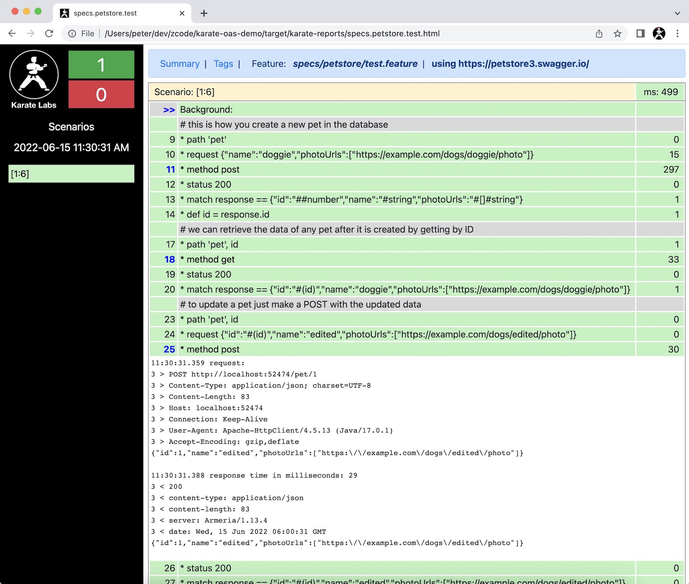

# Karate OAS Demo

## Summary
* a “smart” mock that can validate request payloads against the [OAS](https://www.openapis.org/) / spec
* custom rules can be added - e.g. `upperLimit <= lowerLimit`
* you can tweak behavior or vary the response based on state (or stage within an end-user flow)
* mock should run "locally" (`localhost`)
* mock can be easily included within a CI / CD pipeline

## Prerequisites
This is a normal Java / Maven project. Java 11 is required.

## Demo 1 - Petstore

OAS file: https://petstore3.swagger.io

* [`index.feature`](src/test/java/specs/petstore/index.feature) - This is the user flow as a Karate test
    * Note that it has a "full cycle": create (POST), read (GET), update (PUT), remove (DELETE)
  * The same test can be used as-is on a "real" implementation of the server, by switching the URL
* [`index.js`](src/test/java/specs/petstore/index.js) - This is the machine-generated mock file
  * All request payloads have been converted into Karate schema validators
  * Examples for all response payloads have also been created from the OAS spec
* [`rules.js`](src/test/java/specs/petstore/rules.js) - This is the part written by hand, but simple and just a few lines
  * note how it over-rides behavior for 2 paths, `/pet` and `/pet/{petId}`
  * this adds state-awareness to the mock, for example the GET will return what was POST-ed in a previous call
  * Note how the status code is handled for a DELETE (201) and a not-found scenario (404).
  * There is no-limit to the logic you can add, as long as you are willing to write some simple JS
  * Since `rules.js` is de-coupled, you can re-generate the main `index.js` from the OAS file whenever it changes

### Running
Just execute [`TestRunner`](src/test/java/specs/petstore/TestRunner.java) as a JUnit test. Here is the result:

## Demo 2 - ASTM [UTM](https://www.unmannedairspace.info/emerging-regulations/astm-publishes-new-international-standard-addressing-uas-utm-performance-and-interoperability)
* Protocol: https://github.com/astm-utm/Protocol/blob/master/utm.yaml

* [`index.feature`](src/test/java/specs/utm/index.feature) 
  * Here the test makes 2 calls, but one with a request payload that fails a business rule
* [`index.js`](src/test/java/specs/utm/index.js) - This is the machine-generated mock file
* [`rules.js`](src/test/java/specs/utm/rules.js)
  * we implemented a cross-field validation which is concisely represented in JS as follows:
    * `if (altitude_lower.value >= altitude_upper.value) errors.push('altitude_lower should be lower than altitude_upper')`

### Running
Just execute [`TestRunner`](src/test/java/specs/utm/TestRunner.java) as a JUnit test. Note how the second call failed with a readable error message.

